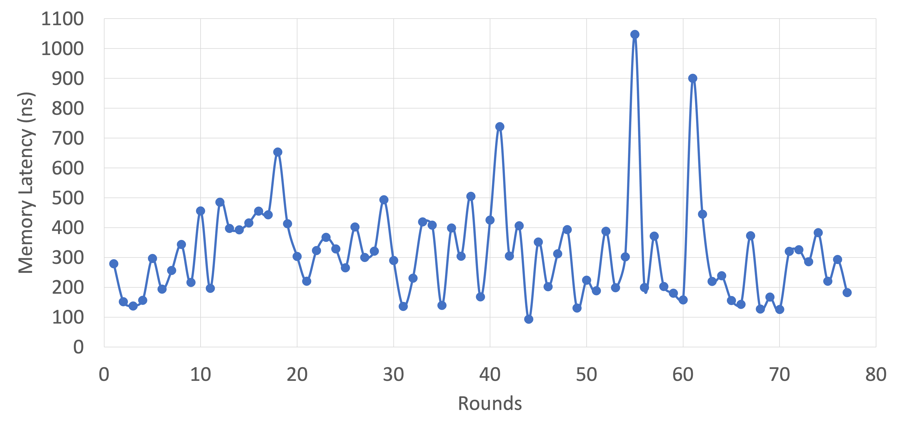

# Monitor Access Latency
<p>This code can be used for calculating the access latency</p>
<p>Memchached: </p>

<p>Redis: </p>


How to run?


```
cd /MonitorAccess
mkdir build
cd build
sudo apt install cmake
cmake ..
make
```
How to measure different applications?
```
# change the name of application here
monitor.measure_process_latency("redis-server");
```
How to measure different processes?

```
# change the pid here
monitor.measure_process_latency(pid);
```
